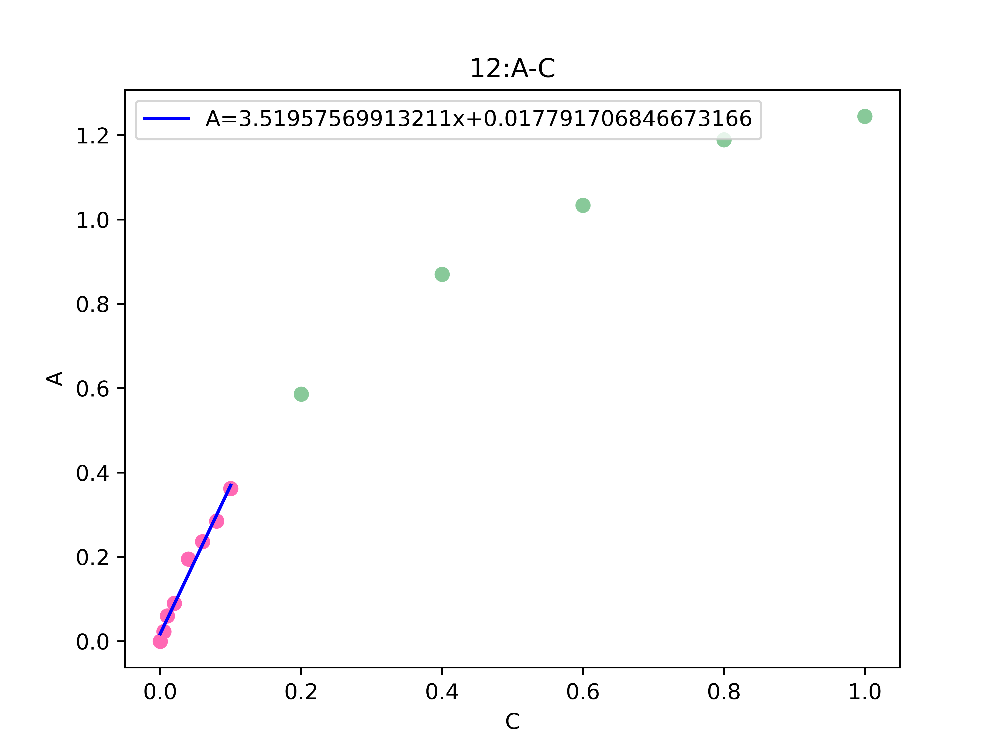
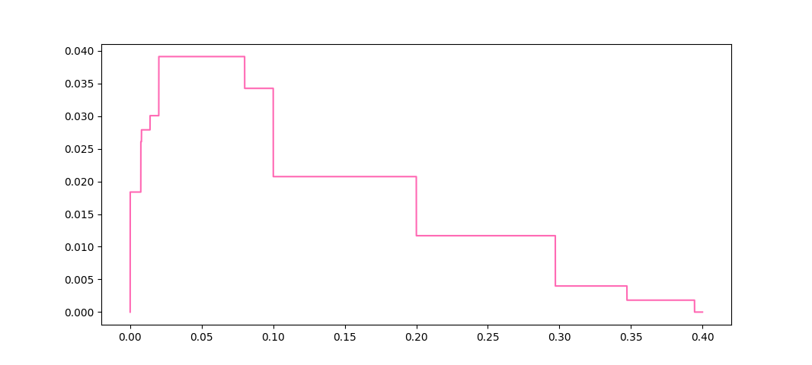

# 考马斯亮蓝测定蛋白质含量的浓度范围讨论
## 一、寻找线性范围
### 1.滑动窗口
以下图为例，我们在选取点的时候要保证是连续的且不少于五个点，否则得出线性是无意义的。可见我们更注重的是连续点的个数，这关乎我们结果的可信度，所以采用滑动窗口的方式来查找符合 $R$ 阈值的点的个数并选取最大的。


滑动窗口图解：

可以结合下表的程序运行数据理解 (__\result\process\process12.csv__) :

| 起始组 | 终止组 | r                  | d                    | k                  |
|--------|--------|--------------------|----------------------|--------------------|
| 1      | 13     | 0.9247928661727085 | 0.1433499782103428   | 1.3005883207437539 |
| 1      | 12     | 0.9396169216063789 | 0.11998781735979219  | 1.507622545003237  |
| 2      | 13     | 0.9270266947162885 | 0.1636699566701909   | 1.2702746666539089 |
| 1      | 11     | 0.9418240102145368 | 0.09896936577291493  | 1.7507174762362618 |
| 2      | 12     | 0.9428413950039252 | 0.13812702943413946  | 1.4732624951293587 |
| 3      | 13     | 0.9299549709785505 | 0.18771258248683925  | 1.2347920219470598 |
| 1      | 10     | 0.954533366037502  | 0.07171456440454468  | 2.174704214157982  |
| 2      | 11     | 0.9455094910148969 | 0.11530859820903133  | 1.7081940712275157 |
| 3      | 12     | 0.9470287995411244 | 0.15966464291420346  | 1.4330534938779071 |
| 4      | 13     | 0.9323427140118447 | 0.21477281553398075  | 1.1952338923212704 |
| 1      | 9      | 0.9754466762787234 | 0.036665532494045555 | 2.9262334127254177 |
| 2      | 10     | 0.9585449924312645 | 0.08542452018245966  | 2.118228763232637  |
| 3      | 11     | 0.950405405525863  | 0.13489191564147623  | 1.658260105448155  |
| 4      | 12     | 0.9507246608069321 | 0.1836100210231254   | 1.3889173090399438 |
| 5      | 13     | 0.9371125139546645 | 0.24947925508878283  | 1.1453313122563884 |
| **1**  | **8** |==0.9823401189516285==|**0.017791706846673166**|**3.51957569913211**|
| 2      | 9      | 0.9777566350564592 | 0.046493366411390374 | 2.844763240211411  |
| 3      | 10     | 0.9642084362009266 | 0.1021680193949615   | 2.051270159165173  |
| 4      | 11     | 0.9545159307743595 | 0.15644887780548627  | 1.604272651704073  |
| 5      | 12     | 0.9575449355465344 | 0.21481689401888748  | 1.3326600209863595 |
| 6      | 13     | 0.9346149490403725 | 0.27834732319894256  | 1.1050066093853272 |

### 2. $\chi^2$ 分布与综合线性浓度区间
我们现在可以通过移动窗口的方法准确的找到符合我所期望 $R$ 值的线性范围，但这是针对一组数据而言的。现在我们拥有多组数据，每一组都有其对应的线性浓度范围，这是就需要对实验结果进行综合分析，以得到合适的、准确的、可解释的线性浓度范围。这其中会遇到数据上的一些问题，这些将在下两点在做讨论。
现在，我们假设已经经数据处理得到结果较好的几组,例如：

|group|type |start|end |R         |d         |k       |
|-----|-----|-----|----|----------|----------|--------|
|2  |good   |1    |7   |0.984863  |0.013289  |3.813842|
|10 |good   |1    |8   |0.984667  |0.017288  |3.541884|
|11 |good   |1    |8   |0.986501  |0.011636  |3.679074|
|12 |good   |1    |8   |0.982340  |0.017792  |3.519576|

这4组的结果相近且符合预期，这我们设想对结果较好的组赋予较高的权重，这样对每所有组浓度范围加权求和，从而得到一个本次实验的线性浓度的概率密度函数。这里权重简单的采用高于 $R$ 阈值的量来表示, 所以浓度分布 $W$ 如下所示：




$\chi^2$ 分布可较好的体现上图所呈现的分布特征，其概率密度函数如下：

$$ 
f(x)=\left\{
\begin{aligned}
&\frac{1}{2^{\frac{n}{2}}\Gamma(\frac{n}{2})}x^{\frac{n}{2}-1}e^{-\frac{x}{2}}     &x \geqslant 0\\
&0    & x < 0\\
\end{aligned}
\right.
$$

下图为 $\chi^2$ 分布的概率密度函数的拟合效果，蓝色部分为95%置信度的线性浓度区间。

分析结果：
我们有95%的把握认为当浓度在 0.0002-0.3000 $mg/ml$ 是呈线性的。

### 3. 数据清洗
#### 去除缺失数据
原始数据：

| group | 0 | 0.005 | 0.01  | 0.02  | 0.04  | 0.06  | 0.08  | 0.1   | 0.2   | 0.4   | 0.6   | 0.8   | 1     | 2     | 4     | 6     | 8     | 10    |
|-------|---|-------|-------|-------|-------|-------|-------|-------|-------|-------|-------|-------|-------|-------|-------|-------|-------|-------|
| 1     | 0 | 0.012 | 0.018 | 0.072 | 0.09  | 0.186 | 0.223 | 0.258 | 0.48  | 0.943 | 1.016 | 1.174 | 1.353 |       |       |       |       |       |
| 2     | 0 | 0.041 | 0.082 | 0.121 | 0.172 | 0.289 | 0.515 | 0.726 | 0.93  | 1.149 | 1.22  | 1.282 | 1.486 | 2.166 | 2.563 | 3.472 | 2.488 | 3.288 |
| 3     | 0 | 0.02  | 0.062 | 0.098 | 0.177 | 0.257 | 0.299 | 0.306 | 0.52  | 0.687 | 1.096 | 1.202 | 1.026 |       |       |       |       |       |
| 4     | 0 | 0.047 | 0.029 | 0.11  | 0.212 | 0.27  | 0.332 | 0.341 | 0.664 | 0.712 | 0.849 | 0.931 | 1.078 |       |       |       |       |       |
| 5     | 0 | 0.011 | 0.131 | 0.135 | 0.144 | 0.23  | 0.342 | 0.346 | 0.724 | 0.853 | 1.117 | 1.341 | 1.62  | 2.076 | 2.101 |       |       |       |
| 6     | 0 | 0.008 | 0.011 | 0.078 | 0.147 | 0.217 | 0.238 | 0.322 | 0.397 | 0.674 | 0.91  | 1.13  | 0     |       |       |       |       |       |
| 7     | 0 | 0.05  | 0.068 | 0.125 | 0.18  | 0.276 | 0.291 | 0.372 | 0.519 | 0.755 | 1.031 | 1.174 | 1.365 | 1.875 |       |       |       |       |
| 8     | 0 | 0.013 | 0.132 | 0.148 | 0.233 | 0.345 | 0.736 | 0.906 | 1.105 | 1.223 | 1.339 | 1.621 | 2.075 | 2.096 |       |       |       |       |
| 9     | 0 | 0.049 | 0.098 | 0.123 | 0.218 | 0.301 | 0.334 | 0.412 | 0.547 | 0.833 | 1.088 | 1.340 | 1.500 | 1.744 | 2.126 |       |       |       |
| 10    | 0 | 0.008 | 0.038 | 0.112 | 0.17  | 0.233 | 0.262 | 0.229 | 0.273 | 0.412 | 0.588 | 0.882 | 0.769 | 0.227 |       |       |       |       |
| 11    | 0 | 0.024 | 0.059 | 0.089 | 0.194 | 0.235 | 0.292 | 0.361 | 0.591 | 0.767 | 1.241 | 2.311 | 2.721 |       |       |       |       |       |
| 12    | 0 | 0.019 | 0.059 | 0.101 | 0.178 | 0.205 | 0.303 | 0.387 | 0.511 | 0.908 | 1.009 | 1.311 | 1.548 |       |       |       |       |       |
| 13    | 0 | 0.023 | 0.06  | 0.09  | 0.195 | 0.236 | 0.285 | 0.362 | 0.586 | 0.87  | 1.034 | 1.189 | 1.245 | 1.621 | 2.045 |       |       |       |
| 14    | 0 | 0.023 | 0.051 |       |       | 0.218 | 0.301 | 0.363 |       |       |       |       |       |       |       |       |       |       |

#### 舍去实验结果较不理想的组
舍去的组：

|group|type |start|end |R         |d         |k       |
|-----|-----|-----|----|----------|----------|--------|
|1    |bad  |2    |6   |0.974424  |0.028976  |4.149038|
|7    |bad  |8    |12  |0.959611  |0.855268  |0.913171|
|9    |bad  |2    |6   |0.964065  |0.004550  |3.987019|

保留的组：

|group|type |start|end |R         |d         |k       |
|-----|-----|-----|----|----------|----------|--------|
|0  |good   |1    |10  |0.996308  |0.013683  |2.344445|
|2  |good   |1    |7   |0.984863  |0.013289  |3.813842|
|3  |good   |4    |9   |0.985699  |0.077279  |2.930656|
|4  |good   |4    |9   |0.983343  |0.037639  |3.390328|
|**5** |good   |4    |**12**  |0.987698  |0.126748  |**1.292292**|
|**6** |good   |5    |**13**  |0.982169  |0.222313  |**1.207982**|
|**8**  |good   |4    |**13**  |0.981823  |0.216722  |**1.372357**|
|10 |good   |1    |8   |0.984667  |0.017288  |3.541884|
|11 |good   |1    |8   |0.986501  |0.011636  |3.679074|
|12 |good   |1    |8   |0.982340  |0.017792  |3.519576|

### 4. 规范浓度
可以明显看出5，6，8组线性部分的斜率与其他组有较大的差异，且这种差异性与线性开始组和结束组，尤其是结束组密切相关，我们猜想这样的异常是由不同的稀释方法导致的。一般情况下最好是将其舍去的，但这样的话就没几组数据了，所以考虑将其规范到相近的浓度。
观察**朗博——比尔定律**：
$$
A = \varepsilon bC
$$

对于同一温度下的同一物质，在同型号的分光机，我们可以假定 $\varepsilon$ 是常数，同时我们所使用的比色皿的厚度基本是一致的，那么实验中的 $k$ 较小就有可能是由稀释时较小的浓度梯度导致的。这样我们就可以将浓度按斜率比率缩放到合适的大小。

## 二、规范测定方法
此部分简要展示和比较The Bradford assay(Bradford,1976)和Protocol for the Bradford assay(Clara L. Kielkopf etc,2020)两种方法。

### The Bradford assay(standard method)
#### 实验方法
0.1ml蛋白溶液(从10到100微克梯度,用缓冲溶液补齐体积到0.1ml)、5ml bradford试剂。充分震荡摇匀后，在2min后1h前以空白组(仅bradford试剂)对照，以蛋白质量为横轴，吸光度为纵轴绘制标准曲线。  
#### 线性范围
经比较，此处使用的bradford试剂和本实验报告中提供的配方完全一致，若配置过程按照实验报告进行，可认为使用了同样的bradford试剂，这为分析文献中Figure1提供基础。但由于没有精确实验数据而只能粗略目测，文献中线性范围大致相当于本实验中0到0.05mg/ml，但考虑到温度，湿度，材料来源，操作方法等变量，此线性范围仅供参考。
### Protocol for the Bradford assay
#### 实验方法
0到20微克蛋白浓度梯度(使用去离子水补充体积到20微升)、10微升缓冲液、1ml bradford试剂。充分混合均匀后，室温条件5min，以空白组为对照测量吸光度，绘制标准曲线。
#### 优势和不足
后者是为96-well plate format(96孔平板)设计的方法，优势是用量少，使用multi-channel pipettle(多通道移液器)操作简便，而且标准和样品的吸光度可以同时读取，缺陷是其它物质的干扰影响有所增加。

***
### 参考文献
1.Bradford MM. A rapid and sensitive method for the quantitation of microgram quantities of protein utilizing the principle of protein-dye binding. Anal Biochem. 1976 May 7;72:248-54. doi: 10.1006/abio.1976.9999. PMID: 942051.

2.Kielkopf CL, Bauer W, Urbatsch IL. Bradford Assay for Determining Protein Concentration. Cold Spring Harb Protoc. 2020 Apr 1;2020(4):102269. doi: 10.1101/pdb.prot102269. PMID: 32238597.

## 附件
导入相关库
```python
from matplotlib.pylab import plt
import numpy as np
import pandas as pd 
from scipy.stats import chi2
from scipy import optimize as op
import math as m
import csv
from sklearn.linear_model import LinearRegression
```
查找单组线性浓度范围
```python
class Opsp:
    def __init__(self,data,r,label) -> None:
        self.__data = data
        self.__label = label
        self.__r = r
        self.__len = len(label)
        self.__result = []
        self.__best = None
        self.__group = '_test'
    
    def name(self,group):
        self.__group = group

    
    def fit(self):
        for n in range(self.__len,4,-1):
            rl = list()
            for i in range(self.__len-n+1):
                r = self.__linefit(i,i+n)
                rl.append(r)
            if max(rl)>=self.__r:
                index = rl.index(max(rl))
                self.__best = self.__result[index+n-self.__len-1]
                self.__type = [self.__group,'good']+self.__best
                self.__d = self.__best[3]
                self.__k = self.__best[4]
                break
        else:
            index = rl.index(max(rl))
            self.__best = self.__result[index+n-self.__len-1]
            self.__type = [self.__group,'bad']+self.__best
            self.__d = self.__best[3]
            self.__k = self.__best[4]


    def __linefit(self,i,j):
        Y = np.array(self.__data[i:j])
        X = np.array(self.__label[i:j]).reshape((-1, 1))
        model_line = LinearRegression()
        model_line.fit(X,Y)
        r = model_line.score(X,Y)
        d = model_line.intercept_
        k = model_line.coef_[0]
        self.__result.append([i+1,j,r,d,k])
        return r

    def fig(self,savefig=False,showfig=True):
        i = self.__best[0]-1
        j = self.__best[1]

        l = 0.001
        st = self.__label[i]
        ed =  self.__label[j-1]
        X_line = np.linspace(st,ed,int((ed-st)/l),endpoint=True) 
        Y_line = self.__k*X_line+self.__d


        X_u = self.__label[i:j]
        Y_u = self.__data[i:j]
        X_nu = self.__label[0:i]+self.__label[j:]
        Y_nu = self.__data[0:i]+self.__data[j:]

        fig,ax = plt.subplots()

        ax.set_title(f'{self.__group}:A-C') #标题
        ax.set_ylabel('A')  #y轴标签
        ax.set_xlabel('C')  #x轴标签

        ax.scatter(X_u,Y_u,color = 'hotpink')
        ax.scatter(X_nu,Y_nu, color = '#88c999')  
        ax.plot(X_line, Y_line, linewidth=1.5,label=f'A={self.__k}x+{self.__d}',color='blue')
        plt.legend(loc=0)

        if savefig :
            plt.savefig(f'result/fig/fig{self.__group}.png',dpi=720)
        
        if showfig:
            plt.show()
    
    def get_best(self):

        return self.__type
    
    def result(self,savedata = False):
        if savedata:
            with open(f'result/process/process{self.__group}.csv','w',encoding='utf-8',newline='') as f:
                writer = csv.writer(f)
                writer.writerow(['起始组','终止组','r','d','k'])
                writer.writerows(self.__result)
        result = f'''第{self.__group}组，在R>={self.__r}的条件下，R为{self.__best[2]}，线性部分的起始浓度为{self.__label[self.__best[0]-1]}终止浓度为{self.__label[self.__best[1]-1]}，截距为{self.__d}，斜率为{self.__k}'''
        return result
```
多组线性浓度范围的综合分析 ( 基于$\chi^2$ 分布 )
```python
def count(bst,R,label,confidence = 0.95):
    bst = pd.DataFrame(bst,columns=['group','type','start','end','R','d','k'])
    bst_bad = bst[bst['type'] =='bad']
    print('\n舍去的组：')
    print(bst_bad)
    bst_good = bst[bst['type'] =='good']
    bst_good_A = bst_good[bst_good['group'] == 0].values.tolist()[0]
    bst_good_B = bst_good[bst_good['k']>2.8]
    k_mean_b = np.mean(bst_good_B['k'])
    bst_good_B = bst_good_B.values.tolist()
    bst_good_C = bst_good[bst_good['k']<2].values.tolist()
    print('\n保留的组：')
    print(bst_good)

    #bst_good_c=[[bst_good_A[0],label[bst_good_A[2]-1],label[bst_good_A[3]-1],bst_good_A[4]-R]]
    bst_good_c=[]
    
    for line in bst_good_B:
        g = line[0]
        s = label[line[2]-1]
        e = label[line[3]-1]
        bst_good_c.append([g,s,e,line[4]-R])

    for line in bst_good_C:
        g = line[0]
        s = label[line[2]-1]*line[6]/k_mean_b
        e = label[line[3]-1]*line[6]/k_mean_b
        bst_good_c.append([g,s,e,line[4]-R])
    
    #bst_good = pd.DataFrame(bst_good_c,columns=['group','start','end','R'])

    n = 100000
    st,en = 0,0.4
    X = [i/n*(en-st) for i in range(n+1)]
    Y = [0]*(n+1)
    for mo in bst_good_c:
        for i in range(n+1):
            if mo[1]<X[i]<mo[2]:
                Y[i]+=mo[3]
    X_f = np.array(X)
    Y_f = np.array(Y)
    C,k,df = op.curve_fit(Cchi2,X_f,Y_f,bounds=(0,5))[0]
    print(f'C={C},k={k},df={df}')
    X_f = pd.DataFrame(X)
    Y_f = X_f.apply(lambda x:Cchi2(x,c=C,k=k,df=df)).values.reshape(n+1,)

    for x in X:
        x1 = x/m.exp(k)
        cdf_a = chi2.cdf(x,df)
        x2 = chi2.ppf(cdf_a+confidence,df)
        if chi2.pdf(x2,df)<chi2.pdf(x1,df):
            a,b = x1,x2
            break
    
    a,b  = a/m.exp(k),b/m.exp(k)
    print(a,b)

    X = np.array(X)
    Y = np.array(Y)
    Y0 = np.array([0]*(n+1))
    fig,ax = plt.subplots()
    ax.plot(X,Y,color = 'hotpink')
    ax.plot(X,Y_f,color = 'r')
    plt.fill_between(X,Y_f,Y0,where=(a<X)&(X<b),color='dodgerblue', alpha=0.5)
    plt.show()
```
修正 $\chi^2$ 分布
```python
def Cchi2(x,c,k,df):
    return c*chi2.pdf(m.exp(k)*x, df)
```
主程序
```python
if __name__=='__main__':
    datas = pd.read_excel('datao.xlsx')
    label = [0,0.005,0.010,0.02,0.04,0.06,0.08,0.1,0.2,0.4,0.6,0.8,1]
    R = 0.98
    i = 1 
    bst = []

    for i in range(13):
        da = datas.loc[i,0:1]
        da = da.values.tolist()
        model = Opsp(da,R,label)
        model.name(i)
        model.fit()
        #model.fig(savefig=True,showfig=True)
        print(model.result(True))
        bst.append(model.get_best())
        i+=1
    
    confidence = 0.90
    count(bst,R,label,confidence)
```
